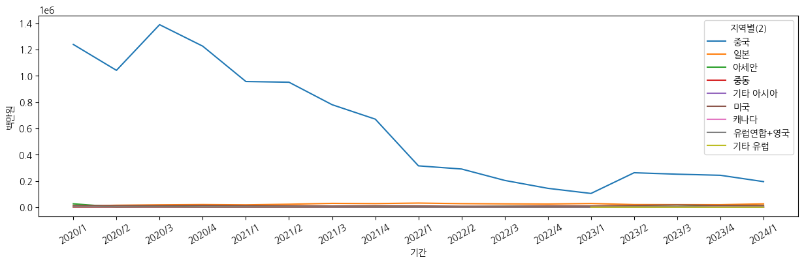
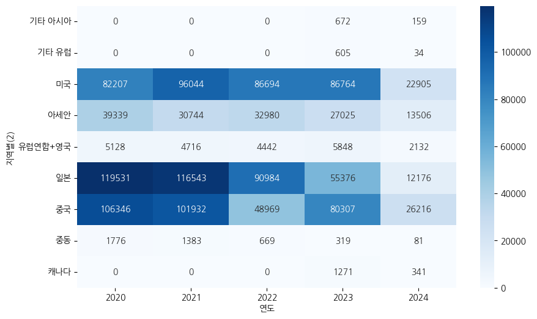

# 상품군별 온라인쇼핑 해외직접판매액 분석

[통계청 KOSIS] | 도소매 서비스 | 온라인쇼핑동향조사 | 지역별 / 상품군별 온라인쇼핑 해외직접판매액

최근 5년간 데이터 (2014.1/4 ~ 2024.1/4)

(https://kosis.kr/statHtml/statHtml.do?orgId=101&tblId=DT_1KE10081&vw_cd=MT_ZTITLE&list_id=JF&seqNo=&lang_mode=ko&language=kor&obj_var_id=&itm_id=&conn_path=MT_ZTITLE)

#### 1. 주제

지역별/상품군별 온라인쇼핑 해외직접판매액 최근 5년간 데이터 분석

#### 2. 동기

통계청 온라인쇼핑동향조사를 통해 지역별/상품군별 온라인쇼핑 해외직접판매액의 변화를 파악하고, 이를 바탕으로 국내 온라인쇼핑 산업의 발전 방향을 모색하고자 함

#### 3. 성찰

데이터 분석을 통해 지역별/상품군별 온라인쇼핑
해외직접판매액의 변화를 파악하고, 이를 바탕으로 국내 온라인쇼핑 산업의 발전 방향을 모색할 수 있었음.
데이터 분석 과정에서 다양한 통계적 기법을 활용하여 데이터를 분석하고, 이를 시각화하는 능력을 향상시킬 수 있었음

#### 4. 참고 문헌

네이버 부스트코스 <파이썬으로 시작하는 데이터 사이언스>
(https://www.boostcourse.org/ds112/lecture/59899)

#### 5. 데이터 설명

각 행은 특정 지역, 상품군, 판매 유형 및 기간에 대한 판매 데이터를 나타낸다. 각 열은 데이터의 속성을 나타내며, 다양한 수준의 지역, 상품군, 판매 유형 및 판매 금액을 포함한다.

- 지역별(1): 대륙 또는 국가 수준의 분류.
- 지역별(2): 더 세부적인 지역 수준의 분류.
- 지역별(3): 가장 세부적인 지역 수준의 분류.
- 상품군별(1): 대분류 상품군.
- 상품군별(2): 소분류 상품군.
- 판매유형별(1): 판매 유형을 나타내는 열로, '계', '면세점', '면세점 이외'와 같은 값을 가짐.
- 기간: 각 기간을 나타내는 열로, 분기별 데이터를 포함. 예를 들어, '2020.1/4'는 2020년 1분기를 의미.
- 백만원: 해당 기간 동안의 판매 금액을 백만원 단위로 나타내는 열. (판매 성과를 나타내는 종속변수)

#### 6~7. 데이터 분석 및 시각화

```python
import pandas as pd
import numpy as np
import seaborn as sns
import matplotlib.pyplot as plt
```

```python
df = pd.read_csv("data.csv", encoding="cp949")
df.head()
```

<div>
<style scoped>
    .dataframe tbody tr th:only-of-type {
        vertical-align: middle;
    }

    .dataframe tbody tr th {
        vertical-align: top;
    }

    .dataframe thead th {
        text-align: right;
    }

</style>
<table border="1" class="dataframe">
  <thead>
    <tr style="text-align: right;">
      <th></th>
      <th>지역별(1)</th>
      <th>지역별(2)</th>
      <th>지역별(3)</th>
      <th>상품군별(1)</th>
      <th>상품군별(2)</th>
      <th>판매유형별(1)</th>
      <th>2020.1/4</th>
      <th>2020.2/4</th>
      <th>2020.3/4</th>
      <th>2020.4/4</th>
      <th>...</th>
      <th>2021.4/4</th>
      <th>2022.1/4</th>
      <th>2022.2/4</th>
      <th>2022.3/4</th>
      <th>2022.4/4</th>
      <th>2023.1/4</th>
      <th>2023.2/4</th>
      <th>2023.3/4</th>
      <th>2023.4/4</th>
      <th>2024.1/4 p)</th>
    </tr>
  </thead>
  <tbody>
    <tr>
      <th>0</th>
      <td>합계</td>
      <td>소계</td>
      <td>소계</td>
      <td>합계</td>
      <td>소계</td>
      <td>계</td>
      <td>1531212</td>
      <td>1290332</td>
      <td>1656729</td>
      <td>1525174</td>
      <td>...</td>
      <td>932840</td>
      <td>575319</td>
      <td>505011</td>
      <td>421606</td>
      <td>353963</td>
      <td>291336</td>
      <td>481202</td>
      <td>452744</td>
      <td>471927</td>
      <td>399086</td>
    </tr>
    <tr>
      <th>1</th>
      <td>합계</td>
      <td>소계</td>
      <td>소계</td>
      <td>합계</td>
      <td>소계</td>
      <td>면세점</td>
      <td>1297490</td>
      <td>1051987</td>
      <td>1410967</td>
      <td>1247495</td>
      <td>...</td>
      <td>681168</td>
      <td>363520</td>
      <td>300602</td>
      <td>211727</td>
      <td>152997</td>
      <td>111187</td>
      <td>281235</td>
      <td>271525</td>
      <td>280391</td>
      <td>239885</td>
    </tr>
    <tr>
      <th>2</th>
      <td>합계</td>
      <td>소계</td>
      <td>소계</td>
      <td>합계</td>
      <td>소계</td>
      <td>면세점 이외</td>
      <td>233722</td>
      <td>238345</td>
      <td>245762</td>
      <td>277679</td>
      <td>...</td>
      <td>251672</td>
      <td>211799</td>
      <td>204409</td>
      <td>209879</td>
      <td>200966</td>
      <td>180149</td>
      <td>199967</td>
      <td>181219</td>
      <td>191536</td>
      <td>159201</td>
    </tr>
    <tr>
      <th>3</th>
      <td>합계</td>
      <td>소계</td>
      <td>소계</td>
      <td>컴퓨터 및 주변기기</td>
      <td>소계</td>
      <td>계</td>
      <td>4142</td>
      <td>3814</td>
      <td>7722</td>
      <td>3589</td>
      <td>...</td>
      <td>3174</td>
      <td>2943</td>
      <td>3288</td>
      <td>2944</td>
      <td>3195</td>
      <td>4044</td>
      <td>3205</td>
      <td>4260</td>
      <td>3769</td>
      <td>2729</td>
    </tr>
    <tr>
      <th>4</th>
      <td>합계</td>
      <td>소계</td>
      <td>소계</td>
      <td>컴퓨터 및 주변기기</td>
      <td>소계</td>
      <td>면세점</td>
      <td>113</td>
      <td>0</td>
      <td>3497</td>
      <td>0</td>
      <td>...</td>
      <td>0</td>
      <td>0</td>
      <td>0</td>
      <td>0</td>
      <td>0</td>
      <td>0</td>
      <td>0</td>
      <td>0</td>
      <td>0</td>
      <td>0</td>
    </tr>
  </tbody>
</table>
<p>5 rows × 23 columns</p>
</div>

data.csv를 불러온다.

```python
df_melted = df.melt(id_vars=['지역별(1)', '지역별(2)', '지역별(3)', '상품군별(1)', '상품군별(2)', '판매유형별(1)'],
                    var_name='기간', value_name="백만원")
df_melted
```

<div>
<style scoped>
    .dataframe tbody tr th:only-of-type {
        vertical-align: middle;
    }

    .dataframe tbody tr th {
        vertical-align: top;
    }

    .dataframe thead th {
        text-align: right;
    }

</style>
<table border="1" class="dataframe">
  <thead>
    <tr style="text-align: right;">
      <th></th>
      <th>지역별(1)</th>
      <th>지역별(2)</th>
      <th>지역별(3)</th>
      <th>상품군별(1)</th>
      <th>상품군별(2)</th>
      <th>판매유형별(1)</th>
      <th>기간</th>
      <th>백만원</th>
    </tr>
  </thead>
  <tbody>
    <tr>
      <th>0</th>
      <td>합계</td>
      <td>소계</td>
      <td>소계</td>
      <td>합계</td>
      <td>소계</td>
      <td>계</td>
      <td>2020.1/4</td>
      <td>1531212</td>
    </tr>
    <tr>
      <th>1</th>
      <td>합계</td>
      <td>소계</td>
      <td>소계</td>
      <td>합계</td>
      <td>소계</td>
      <td>면세점</td>
      <td>2020.1/4</td>
      <td>1297490</td>
    </tr>
    <tr>
      <th>2</th>
      <td>합계</td>
      <td>소계</td>
      <td>소계</td>
      <td>합계</td>
      <td>소계</td>
      <td>면세점 이외</td>
      <td>2020.1/4</td>
      <td>233722</td>
    </tr>
    <tr>
      <th>3</th>
      <td>합계</td>
      <td>소계</td>
      <td>소계</td>
      <td>컴퓨터 및 주변기기</td>
      <td>소계</td>
      <td>계</td>
      <td>2020.1/4</td>
      <td>4142</td>
    </tr>
    <tr>
      <th>4</th>
      <td>합계</td>
      <td>소계</td>
      <td>소계</td>
      <td>컴퓨터 및 주변기기</td>
      <td>소계</td>
      <td>면세점</td>
      <td>2020.1/4</td>
      <td>113</td>
    </tr>
    <tr>
      <th>...</th>
      <td>...</td>
      <td>...</td>
      <td>...</td>
      <td>...</td>
      <td>...</td>
      <td>...</td>
      <td>...</td>
      <td>...</td>
    </tr>
    <tr>
      <th>16468</th>
      <td>기타</td>
      <td>소계</td>
      <td>소계</td>
      <td>생활·자동차용품</td>
      <td>소계</td>
      <td>면세점</td>
      <td>2024.1/4 p)</td>
      <td>-</td>
    </tr>
    <tr>
      <th>16469</th>
      <td>기타</td>
      <td>소계</td>
      <td>소계</td>
      <td>생활·자동차용품</td>
      <td>소계</td>
      <td>면세점 이외</td>
      <td>2024.1/4 p)</td>
      <td>-</td>
    </tr>
    <tr>
      <th>16470</th>
      <td>기타</td>
      <td>소계</td>
      <td>소계</td>
      <td>기 타</td>
      <td>소계</td>
      <td>계</td>
      <td>2024.1/4 p)</td>
      <td>-</td>
    </tr>
    <tr>
      <th>16471</th>
      <td>기타</td>
      <td>소계</td>
      <td>소계</td>
      <td>기 타</td>
      <td>소계</td>
      <td>면세점</td>
      <td>2024.1/4 p)</td>
      <td>-</td>
    </tr>
    <tr>
      <th>16472</th>
      <td>기타</td>
      <td>소계</td>
      <td>소계</td>
      <td>기 타</td>
      <td>소계</td>
      <td>면세점 이외</td>
      <td>2024.1/4 p)</td>
      <td>-</td>
    </tr>
  </tbody>
</table>
<p>16473 rows × 8 columns</p>
</div>

데이터를 보면 컬럼이 2014.1/4 형식처럼 분기별로 되어있는 것을 볼 수 있다.

그렇기 때문에, melt 함수를 이용하여 예쁘게 정리되도록 하였다.

```python
df_melted.shape
```

    (16473, 8)

```python
df_melted.info()
```

    <class 'pandas.core.frame.DataFrame'>
    RangeIndex: 16473 entries, 0 to 16472
    Data columns (total 8 columns):
     #   Column    Non-Null Count  Dtype
    ---  ------    --------------  -----
     0   지역별(1)    16473 non-null  object
     1   지역별(2)    16473 non-null  object
     2   지역별(3)    16473 non-null  object
     3   상품군별(1)   16473 non-null  object
     4   상품군별(2)   16473 non-null  object
     5   판매유형별(1)  16473 non-null  object
     6   기간        16473 non-null  object
     7   백만원       16473 non-null  object
    dtypes: object(8)
    memory usage: 1.0+ MB

데이터 정보를 보면 각 컬럼당 16473개의 데이터가 수록되어 있다.

```python
df_melted['기간']
```

    0           2020.1/4
    1           2020.1/4
    2           2020.1/4
    3           2020.1/4
    4           2020.1/4
                ...
    16468    2024.1/4 p)
    16469    2024.1/4 p)
    16470    2024.1/4 p)
    16471    2024.1/4 p)
    16472    2024.1/4 p)
    Name: 기간, Length: 16473, dtype: object

그런데 '기간' 데이터를 보면 '년도.분기/4 p' 이런 형태로 되어 있는 것을 볼 수 있다.

```python
df_melted['연도'] = df_melted['기간'].map(lambda x:int(x.split('.')[0]))
df_melted
```

<div>
<style scoped>
    .dataframe tbody tr th:only-of-type {
        vertical-align: middle;
    }

    .dataframe tbody tr th {
        vertical-align: top;
    }

    .dataframe thead th {
        text-align: right;
    }

</style>
<table border="1" class="dataframe">
  <thead>
    <tr style="text-align: right;">
      <th></th>
      <th>지역별(1)</th>
      <th>지역별(2)</th>
      <th>지역별(3)</th>
      <th>상품군별(1)</th>
      <th>상품군별(2)</th>
      <th>판매유형별(1)</th>
      <th>기간</th>
      <th>백만원</th>
      <th>연도</th>
    </tr>
  </thead>
  <tbody>
    <tr>
      <th>0</th>
      <td>합계</td>
      <td>소계</td>
      <td>소계</td>
      <td>합계</td>
      <td>소계</td>
      <td>계</td>
      <td>2020.1/4</td>
      <td>1531212</td>
      <td>2020</td>
    </tr>
    <tr>
      <th>1</th>
      <td>합계</td>
      <td>소계</td>
      <td>소계</td>
      <td>합계</td>
      <td>소계</td>
      <td>면세점</td>
      <td>2020.1/4</td>
      <td>1297490</td>
      <td>2020</td>
    </tr>
    <tr>
      <th>2</th>
      <td>합계</td>
      <td>소계</td>
      <td>소계</td>
      <td>합계</td>
      <td>소계</td>
      <td>면세점 이외</td>
      <td>2020.1/4</td>
      <td>233722</td>
      <td>2020</td>
    </tr>
    <tr>
      <th>3</th>
      <td>합계</td>
      <td>소계</td>
      <td>소계</td>
      <td>컴퓨터 및 주변기기</td>
      <td>소계</td>
      <td>계</td>
      <td>2020.1/4</td>
      <td>4142</td>
      <td>2020</td>
    </tr>
    <tr>
      <th>4</th>
      <td>합계</td>
      <td>소계</td>
      <td>소계</td>
      <td>컴퓨터 및 주변기기</td>
      <td>소계</td>
      <td>면세점</td>
      <td>2020.1/4</td>
      <td>113</td>
      <td>2020</td>
    </tr>
    <tr>
      <th>...</th>
      <td>...</td>
      <td>...</td>
      <td>...</td>
      <td>...</td>
      <td>...</td>
      <td>...</td>
      <td>...</td>
      <td>...</td>
      <td>...</td>
    </tr>
    <tr>
      <th>16468</th>
      <td>기타</td>
      <td>소계</td>
      <td>소계</td>
      <td>생활·자동차용품</td>
      <td>소계</td>
      <td>면세점</td>
      <td>2024.1/4 p)</td>
      <td>-</td>
      <td>2024</td>
    </tr>
    <tr>
      <th>16469</th>
      <td>기타</td>
      <td>소계</td>
      <td>소계</td>
      <td>생활·자동차용품</td>
      <td>소계</td>
      <td>면세점 이외</td>
      <td>2024.1/4 p)</td>
      <td>-</td>
      <td>2024</td>
    </tr>
    <tr>
      <th>16470</th>
      <td>기타</td>
      <td>소계</td>
      <td>소계</td>
      <td>기 타</td>
      <td>소계</td>
      <td>계</td>
      <td>2024.1/4 p)</td>
      <td>-</td>
      <td>2024</td>
    </tr>
    <tr>
      <th>16471</th>
      <td>기타</td>
      <td>소계</td>
      <td>소계</td>
      <td>기 타</td>
      <td>소계</td>
      <td>면세점</td>
      <td>2024.1/4 p)</td>
      <td>-</td>
      <td>2024</td>
    </tr>
    <tr>
      <th>16472</th>
      <td>기타</td>
      <td>소계</td>
      <td>소계</td>
      <td>기 타</td>
      <td>소계</td>
      <td>면세점 이외</td>
      <td>2024.1/4 p)</td>
      <td>-</td>
      <td>2024</td>
    </tr>
  </tbody>
</table>
<p>16473 rows × 9 columns</p>
</div>

map 함수와 lambda 함수를 이용하여

'기간'의 str 값을 split으로 쪼개어 연도만 선택한 값을 '연도' 칼럼으로 따로 만들었다.

```python
df_melted['분기'] = df_melted['기간'].map(lambda x:int(x.split('.')[1].split('/')[0]))
df_melted

```

<div>
<style scoped>
    .dataframe tbody tr th:only-of-type {
        vertical-align: middle;
    }

    .dataframe tbody tr th {
        vertical-align: top;
    }

    .dataframe thead th {
        text-align: right;
    }

</style>
<table border="1" class="dataframe">
  <thead>
    <tr style="text-align: right;">
      <th></th>
      <th>지역별(1)</th>
      <th>지역별(2)</th>
      <th>지역별(3)</th>
      <th>상품군별(1)</th>
      <th>상품군별(2)</th>
      <th>판매유형별(1)</th>
      <th>기간</th>
      <th>백만원</th>
      <th>연도</th>
      <th>분기</th>
    </tr>
  </thead>
  <tbody>
    <tr>
      <th>0</th>
      <td>합계</td>
      <td>소계</td>
      <td>소계</td>
      <td>합계</td>
      <td>소계</td>
      <td>계</td>
      <td>2020.1/4</td>
      <td>1531212</td>
      <td>2020</td>
      <td>1</td>
    </tr>
    <tr>
      <th>1</th>
      <td>합계</td>
      <td>소계</td>
      <td>소계</td>
      <td>합계</td>
      <td>소계</td>
      <td>면세점</td>
      <td>2020.1/4</td>
      <td>1297490</td>
      <td>2020</td>
      <td>1</td>
    </tr>
    <tr>
      <th>2</th>
      <td>합계</td>
      <td>소계</td>
      <td>소계</td>
      <td>합계</td>
      <td>소계</td>
      <td>면세점 이외</td>
      <td>2020.1/4</td>
      <td>233722</td>
      <td>2020</td>
      <td>1</td>
    </tr>
    <tr>
      <th>3</th>
      <td>합계</td>
      <td>소계</td>
      <td>소계</td>
      <td>컴퓨터 및 주변기기</td>
      <td>소계</td>
      <td>계</td>
      <td>2020.1/4</td>
      <td>4142</td>
      <td>2020</td>
      <td>1</td>
    </tr>
    <tr>
      <th>4</th>
      <td>합계</td>
      <td>소계</td>
      <td>소계</td>
      <td>컴퓨터 및 주변기기</td>
      <td>소계</td>
      <td>면세점</td>
      <td>2020.1/4</td>
      <td>113</td>
      <td>2020</td>
      <td>1</td>
    </tr>
    <tr>
      <th>...</th>
      <td>...</td>
      <td>...</td>
      <td>...</td>
      <td>...</td>
      <td>...</td>
      <td>...</td>
      <td>...</td>
      <td>...</td>
      <td>...</td>
      <td>...</td>
    </tr>
    <tr>
      <th>16468</th>
      <td>기타</td>
      <td>소계</td>
      <td>소계</td>
      <td>생활·자동차용품</td>
      <td>소계</td>
      <td>면세점</td>
      <td>2024.1/4 p)</td>
      <td>-</td>
      <td>2024</td>
      <td>1</td>
    </tr>
    <tr>
      <th>16469</th>
      <td>기타</td>
      <td>소계</td>
      <td>소계</td>
      <td>생활·자동차용품</td>
      <td>소계</td>
      <td>면세점 이외</td>
      <td>2024.1/4 p)</td>
      <td>-</td>
      <td>2024</td>
      <td>1</td>
    </tr>
    <tr>
      <th>16470</th>
      <td>기타</td>
      <td>소계</td>
      <td>소계</td>
      <td>기 타</td>
      <td>소계</td>
      <td>계</td>
      <td>2024.1/4 p)</td>
      <td>-</td>
      <td>2024</td>
      <td>1</td>
    </tr>
    <tr>
      <th>16471</th>
      <td>기타</td>
      <td>소계</td>
      <td>소계</td>
      <td>기 타</td>
      <td>소계</td>
      <td>면세점</td>
      <td>2024.1/4 p)</td>
      <td>-</td>
      <td>2024</td>
      <td>1</td>
    </tr>
    <tr>
      <th>16472</th>
      <td>기타</td>
      <td>소계</td>
      <td>소계</td>
      <td>기 타</td>
      <td>소계</td>
      <td>면세점 이외</td>
      <td>2024.1/4 p)</td>
      <td>-</td>
      <td>2024</td>
      <td>1</td>
    </tr>
  </tbody>
</table>
<p>16473 rows × 10 columns</p>
</div>

추가로, '/'로 짤라내서 분기 부분만 추출하여 '분기' 칼럼으로 따로 만들어줬다.

```python
df_melted['기간'] = df_melted['연도'].astype(str) + '/' + df_melted['분기'].astype(str)
df_melted
```

<div>
<style scoped>
    .dataframe tbody tr th:only-of-type {
        vertical-align: middle;
    }

    .dataframe tbody tr th {
        vertical-align: top;
    }

    .dataframe thead th {
        text-align: right;
    }

</style>
<table border="1" class="dataframe">
  <thead>
    <tr style="text-align: right;">
      <th></th>
      <th>지역별(1)</th>
      <th>지역별(2)</th>
      <th>지역별(3)</th>
      <th>상품군별(1)</th>
      <th>상품군별(2)</th>
      <th>판매유형별(1)</th>
      <th>기간</th>
      <th>백만원</th>
      <th>연도</th>
      <th>분기</th>
    </tr>
  </thead>
  <tbody>
    <tr>
      <th>0</th>
      <td>합계</td>
      <td>소계</td>
      <td>소계</td>
      <td>합계</td>
      <td>소계</td>
      <td>계</td>
      <td>2020/1</td>
      <td>1531212</td>
      <td>2020</td>
      <td>1</td>
    </tr>
    <tr>
      <th>1</th>
      <td>합계</td>
      <td>소계</td>
      <td>소계</td>
      <td>합계</td>
      <td>소계</td>
      <td>면세점</td>
      <td>2020/1</td>
      <td>1297490</td>
      <td>2020</td>
      <td>1</td>
    </tr>
    <tr>
      <th>2</th>
      <td>합계</td>
      <td>소계</td>
      <td>소계</td>
      <td>합계</td>
      <td>소계</td>
      <td>면세점 이외</td>
      <td>2020/1</td>
      <td>233722</td>
      <td>2020</td>
      <td>1</td>
    </tr>
    <tr>
      <th>3</th>
      <td>합계</td>
      <td>소계</td>
      <td>소계</td>
      <td>컴퓨터 및 주변기기</td>
      <td>소계</td>
      <td>계</td>
      <td>2020/1</td>
      <td>4142</td>
      <td>2020</td>
      <td>1</td>
    </tr>
    <tr>
      <th>4</th>
      <td>합계</td>
      <td>소계</td>
      <td>소계</td>
      <td>컴퓨터 및 주변기기</td>
      <td>소계</td>
      <td>면세점</td>
      <td>2020/1</td>
      <td>113</td>
      <td>2020</td>
      <td>1</td>
    </tr>
    <tr>
      <th>...</th>
      <td>...</td>
      <td>...</td>
      <td>...</td>
      <td>...</td>
      <td>...</td>
      <td>...</td>
      <td>...</td>
      <td>...</td>
      <td>...</td>
      <td>...</td>
    </tr>
    <tr>
      <th>16468</th>
      <td>기타</td>
      <td>소계</td>
      <td>소계</td>
      <td>생활·자동차용품</td>
      <td>소계</td>
      <td>면세점</td>
      <td>2024/1</td>
      <td>-</td>
      <td>2024</td>
      <td>1</td>
    </tr>
    <tr>
      <th>16469</th>
      <td>기타</td>
      <td>소계</td>
      <td>소계</td>
      <td>생활·자동차용품</td>
      <td>소계</td>
      <td>면세점 이외</td>
      <td>2024/1</td>
      <td>-</td>
      <td>2024</td>
      <td>1</td>
    </tr>
    <tr>
      <th>16470</th>
      <td>기타</td>
      <td>소계</td>
      <td>소계</td>
      <td>기 타</td>
      <td>소계</td>
      <td>계</td>
      <td>2024/1</td>
      <td>-</td>
      <td>2024</td>
      <td>1</td>
    </tr>
    <tr>
      <th>16471</th>
      <td>기타</td>
      <td>소계</td>
      <td>소계</td>
      <td>기 타</td>
      <td>소계</td>
      <td>면세점</td>
      <td>2024/1</td>
      <td>-</td>
      <td>2024</td>
      <td>1</td>
    </tr>
    <tr>
      <th>16472</th>
      <td>기타</td>
      <td>소계</td>
      <td>소계</td>
      <td>기 타</td>
      <td>소계</td>
      <td>면세점 이외</td>
      <td>2024/1</td>
      <td>-</td>
      <td>2024</td>
      <td>1</td>
    </tr>
  </tbody>
</table>
<p>16473 rows × 10 columns</p>
</div>

그리고 기간과 분기를 이용하여 '기간' 컬럼을 새롭게 정의해주었다.

```python
df_melted['백만원'] = df_melted['백만원'].replace('-', np.nan).astype(float)
df_melted

```

<div>
<style scoped>
    .dataframe tbody tr th:only-of-type {
        vertical-align: middle;
    }

    .dataframe tbody tr th {
        vertical-align: top;
    }

    .dataframe thead th {
        text-align: right;
    }

</style>
<table border="1" class="dataframe">
  <thead>
    <tr style="text-align: right;">
      <th></th>
      <th>지역별(1)</th>
      <th>지역별(2)</th>
      <th>지역별(3)</th>
      <th>상품군별(1)</th>
      <th>상품군별(2)</th>
      <th>판매유형별(1)</th>
      <th>기간</th>
      <th>백만원</th>
      <th>연도</th>
      <th>분기</th>
    </tr>
  </thead>
  <tbody>
    <tr>
      <th>0</th>
      <td>합계</td>
      <td>소계</td>
      <td>소계</td>
      <td>합계</td>
      <td>소계</td>
      <td>계</td>
      <td>2020/1</td>
      <td>1531212.0</td>
      <td>2020</td>
      <td>1</td>
    </tr>
    <tr>
      <th>1</th>
      <td>합계</td>
      <td>소계</td>
      <td>소계</td>
      <td>합계</td>
      <td>소계</td>
      <td>면세점</td>
      <td>2020/1</td>
      <td>1297490.0</td>
      <td>2020</td>
      <td>1</td>
    </tr>
    <tr>
      <th>2</th>
      <td>합계</td>
      <td>소계</td>
      <td>소계</td>
      <td>합계</td>
      <td>소계</td>
      <td>면세점 이외</td>
      <td>2020/1</td>
      <td>233722.0</td>
      <td>2020</td>
      <td>1</td>
    </tr>
    <tr>
      <th>3</th>
      <td>합계</td>
      <td>소계</td>
      <td>소계</td>
      <td>컴퓨터 및 주변기기</td>
      <td>소계</td>
      <td>계</td>
      <td>2020/1</td>
      <td>4142.0</td>
      <td>2020</td>
      <td>1</td>
    </tr>
    <tr>
      <th>4</th>
      <td>합계</td>
      <td>소계</td>
      <td>소계</td>
      <td>컴퓨터 및 주변기기</td>
      <td>소계</td>
      <td>면세점</td>
      <td>2020/1</td>
      <td>113.0</td>
      <td>2020</td>
      <td>1</td>
    </tr>
    <tr>
      <th>...</th>
      <td>...</td>
      <td>...</td>
      <td>...</td>
      <td>...</td>
      <td>...</td>
      <td>...</td>
      <td>...</td>
      <td>...</td>
      <td>...</td>
      <td>...</td>
    </tr>
    <tr>
      <th>16468</th>
      <td>기타</td>
      <td>소계</td>
      <td>소계</td>
      <td>생활·자동차용품</td>
      <td>소계</td>
      <td>면세점</td>
      <td>2024/1</td>
      <td>NaN</td>
      <td>2024</td>
      <td>1</td>
    </tr>
    <tr>
      <th>16469</th>
      <td>기타</td>
      <td>소계</td>
      <td>소계</td>
      <td>생활·자동차용품</td>
      <td>소계</td>
      <td>면세점 이외</td>
      <td>2024/1</td>
      <td>NaN</td>
      <td>2024</td>
      <td>1</td>
    </tr>
    <tr>
      <th>16470</th>
      <td>기타</td>
      <td>소계</td>
      <td>소계</td>
      <td>기 타</td>
      <td>소계</td>
      <td>계</td>
      <td>2024/1</td>
      <td>NaN</td>
      <td>2024</td>
      <td>1</td>
    </tr>
    <tr>
      <th>16471</th>
      <td>기타</td>
      <td>소계</td>
      <td>소계</td>
      <td>기 타</td>
      <td>소계</td>
      <td>면세점</td>
      <td>2024/1</td>
      <td>NaN</td>
      <td>2024</td>
      <td>1</td>
    </tr>
    <tr>
      <th>16472</th>
      <td>기타</td>
      <td>소계</td>
      <td>소계</td>
      <td>기 타</td>
      <td>소계</td>
      <td>면세점 이외</td>
      <td>2024/1</td>
      <td>NaN</td>
      <td>2024</td>
      <td>1</td>
    </tr>
  </tbody>
</table>
<p>16473 rows × 10 columns</p>
</div>

'백만원' 컬럼에 - 와 같이 미기입된 데이터가 있으므로,

pd.np.nan으로 NaN 데이터로 변경해주고, float 형식으로 지정하였다.

```python
df_melted2 = df_melted[(df_melted['지역별(1)']!='합계')&(df_melted['지역별(2)']!='소계')&(df_melted['상품군별(1)']!='합계')]
df_melted2

```

<div>
<style scoped>
    .dataframe tbody tr th:only-of-type {
        vertical-align: middle;
    }

    .dataframe tbody tr th {
        vertical-align: top;
    }

    .dataframe thead th {
        text-align: right;
    }

</style>
<table border="1" class="dataframe">
  <thead>
    <tr style="text-align: right;">
      <th></th>
      <th>지역별(1)</th>
      <th>지역별(2)</th>
      <th>지역별(3)</th>
      <th>상품군별(1)</th>
      <th>상품군별(2)</th>
      <th>판매유형별(1)</th>
      <th>기간</th>
      <th>백만원</th>
      <th>연도</th>
      <th>분기</th>
    </tr>
  </thead>
  <tbody>
    <tr>
      <th>105</th>
      <td>아시아</td>
      <td>중국</td>
      <td>소계</td>
      <td>컴퓨터 및 주변기기</td>
      <td>소계</td>
      <td>계</td>
      <td>2020/1</td>
      <td>61.0</td>
      <td>2020</td>
      <td>1</td>
    </tr>
    <tr>
      <th>106</th>
      <td>아시아</td>
      <td>중국</td>
      <td>소계</td>
      <td>컴퓨터 및 주변기기</td>
      <td>소계</td>
      <td>면세점</td>
      <td>2020/1</td>
      <td>0.0</td>
      <td>2020</td>
      <td>1</td>
    </tr>
    <tr>
      <th>107</th>
      <td>아시아</td>
      <td>중국</td>
      <td>소계</td>
      <td>컴퓨터 및 주변기기</td>
      <td>소계</td>
      <td>면세점 이외</td>
      <td>2020/1</td>
      <td>61.0</td>
      <td>2020</td>
      <td>1</td>
    </tr>
    <tr>
      <th>108</th>
      <td>아시아</td>
      <td>중국</td>
      <td>소계</td>
      <td>가전·전자·통신기기</td>
      <td>소계</td>
      <td>계</td>
      <td>2020/1</td>
      <td>3096.0</td>
      <td>2020</td>
      <td>1</td>
    </tr>
    <tr>
      <th>109</th>
      <td>아시아</td>
      <td>중국</td>
      <td>소계</td>
      <td>가전·전자·통신기기</td>
      <td>소계</td>
      <td>면세점</td>
      <td>2020/1</td>
      <td>2653.0</td>
      <td>2020</td>
      <td>1</td>
    </tr>
    <tr>
      <th>...</th>
      <td>...</td>
      <td>...</td>
      <td>...</td>
      <td>...</td>
      <td>...</td>
      <td>...</td>
      <td>...</td>
      <td>...</td>
      <td>...</td>
      <td>...</td>
    </tr>
    <tr>
      <th>16264</th>
      <td>유럽</td>
      <td>기타 유럽</td>
      <td>소계</td>
      <td>생활·자동차용품</td>
      <td>소계</td>
      <td>면세점</td>
      <td>2024/1</td>
      <td>0.0</td>
      <td>2024</td>
      <td>1</td>
    </tr>
    <tr>
      <th>16265</th>
      <td>유럽</td>
      <td>기타 유럽</td>
      <td>소계</td>
      <td>생활·자동차용품</td>
      <td>소계</td>
      <td>면세점 이외</td>
      <td>2024/1</td>
      <td>68.0</td>
      <td>2024</td>
      <td>1</td>
    </tr>
    <tr>
      <th>16266</th>
      <td>유럽</td>
      <td>기타 유럽</td>
      <td>소계</td>
      <td>기 타</td>
      <td>소계</td>
      <td>계</td>
      <td>2024/1</td>
      <td>6.0</td>
      <td>2024</td>
      <td>1</td>
    </tr>
    <tr>
      <th>16267</th>
      <td>유럽</td>
      <td>기타 유럽</td>
      <td>소계</td>
      <td>기 타</td>
      <td>소계</td>
      <td>면세점</td>
      <td>2024/1</td>
      <td>0.0</td>
      <td>2024</td>
      <td>1</td>
    </tr>
    <tr>
      <th>16268</th>
      <td>유럽</td>
      <td>기타 유럽</td>
      <td>소계</td>
      <td>기 타</td>
      <td>소계</td>
      <td>면세점 이외</td>
      <td>2024/1</td>
      <td>6.0</td>
      <td>2024</td>
      <td>1</td>
    </tr>
  </tbody>
</table>
<p>8976 rows × 10 columns</p>
</div>

데이터 내 '합계'인 데이터를 제외하였다.

```python
df_melted2.info()
```

    <class 'pandas.core.frame.DataFrame'>
    Index: 8976 entries, 105 to 16268
    Data columns (total 10 columns):
     #   Column    Non-Null Count  Dtype
    ---  ------    --------------  -----
     0   지역별(1)    8976 non-null   object
     1   지역별(2)    8976 non-null   object
     2   지역별(3)    8976 non-null   object
     3   상품군별(1)   8976 non-null   object
     4   상품군별(2)   8976 non-null   object
     5   판매유형별(1)  8976 non-null   object
     6   기간        8976 non-null   object
     7   백만원       5664 non-null   float64
     8   연도        8976 non-null   int64
     9   분기        8976 non-null   int64
    dtypes: float64(1), int64(2), object(7)
    memory usage: 771.4+ KB

```python
df_melted2.isnull().sum()
df_melted2.head()
```

<div>
<style scoped>
    .dataframe tbody tr th:only-of-type {
        vertical-align: middle;
    }

    .dataframe tbody tr th {
        vertical-align: top;
    }

    .dataframe thead th {
        text-align: right;
    }

</style>
<table border="1" class="dataframe">
  <thead>
    <tr style="text-align: right;">
      <th></th>
      <th>지역별(1)</th>
      <th>지역별(2)</th>
      <th>지역별(3)</th>
      <th>상품군별(1)</th>
      <th>상품군별(2)</th>
      <th>판매유형별(1)</th>
      <th>기간</th>
      <th>백만원</th>
      <th>연도</th>
      <th>분기</th>
    </tr>
  </thead>
  <tbody>
    <tr>
      <th>105</th>
      <td>아시아</td>
      <td>중국</td>
      <td>소계</td>
      <td>컴퓨터 및 주변기기</td>
      <td>소계</td>
      <td>계</td>
      <td>2020/1</td>
      <td>61.0</td>
      <td>2020</td>
      <td>1</td>
    </tr>
    <tr>
      <th>106</th>
      <td>아시아</td>
      <td>중국</td>
      <td>소계</td>
      <td>컴퓨터 및 주변기기</td>
      <td>소계</td>
      <td>면세점</td>
      <td>2020/1</td>
      <td>0.0</td>
      <td>2020</td>
      <td>1</td>
    </tr>
    <tr>
      <th>107</th>
      <td>아시아</td>
      <td>중국</td>
      <td>소계</td>
      <td>컴퓨터 및 주변기기</td>
      <td>소계</td>
      <td>면세점 이외</td>
      <td>2020/1</td>
      <td>61.0</td>
      <td>2020</td>
      <td>1</td>
    </tr>
    <tr>
      <th>108</th>
      <td>아시아</td>
      <td>중국</td>
      <td>소계</td>
      <td>가전·전자·통신기기</td>
      <td>소계</td>
      <td>계</td>
      <td>2020/1</td>
      <td>3096.0</td>
      <td>2020</td>
      <td>1</td>
    </tr>
    <tr>
      <th>109</th>
      <td>아시아</td>
      <td>중국</td>
      <td>소계</td>
      <td>가전·전자·통신기기</td>
      <td>소계</td>
      <td>면세점</td>
      <td>2020/1</td>
      <td>2653.0</td>
      <td>2020</td>
      <td>1</td>
    </tr>
  </tbody>
</table>
</div>

```python
df_tot = df_melted2[df_melted2['판매유형별(1)'] == '계'].copy()
```

데이터 중 '판매유형별' 값이 '계'인 데이터만 복사하여 df_tot로 저장하였다.

```python
sns.lineplot(data=df_tot, x='연도', y='백만원', hue='상품군별(1)')
plt.legend(bbox_to_anchor=(1.05, 1), loc=2, borderaxespad=0)

```

    <matplotlib.legend.Legend at 0x306a7c1a0>


df_tot 데이터를 연도-백만원 그래프로 상품군별로 시각화하였다.

가장 큰 판매액은 '화장품' 상품인 것을 한 눈에 볼 수 있었다.

```python
df_sub = df_tot[~df_tot['상품군별(1)'].isin(['화장품'])].copy()
```

화장품 상품군이 압도적으로 많기 때문에 '화장품'을 제외한 데이터만 카피하여 df_sub에 저장하였다.

```python
sns.relplot(data=df_sub, x='연도', y='백만원', hue='상품군별(1)', kind='line', col='상품군별(1)', col_wrap=4)
```

    <seaborn.axisgrid.FacetGrid at 0x306d786e0>


화장품을 제외한 나머지 상품들(df_sub)을 시각화하였다.

```python
df_sub2 = df_tot[~df_tot['상품군별(1)'].isin(['화장품', '의류 및 패션 관련 상품', '음반·비디오·악기', '기 타', '가전·전자·통신기기'])].copy()
sns.relplot(data=df_sub2, x='연도', y='백만원', hue='상품군별(1)', kind='line', col='상품군별(1)', col_wrap=4)
```

    <seaborn.axisgrid.FacetGrid at 0x3071a0b00>


앞선 그래프에서 '화장품' 상품 뿐만 아니라, '의류 및 패션 관련상품', '음반·비디오·악기', '가전·전자·통신기기', '기타' 항목도 큰 격차를 보이기 때문에 다시 한 번 sub로 지정하고 나머지 항목들을 시각화 해보았다.

```python
sns.relplot(data=df_tot[df_tot['상품군별(1)']=='농축수산물'], x='연도', y='백만원', hue='상품군별(1)', kind='line')
```

    <seaborn.axisgrid.FacetGrid at 0x30a7e8b00>


그럼에도 불구하고, 평균 범위 내 표현이 잘 안 되는 '농축수산물'에 대해선 따로 시각화를 수행하였다.

```python
df_cos = df_tot[df_tot['상품군별(1)']=='화장품'].copy()
df_cos

```

<div>
<style scoped>
    .dataframe tbody tr th:only-of-type {
        vertical-align: middle;
    }

    .dataframe tbody tr th {
        vertical-align: top;
    }

    .dataframe thead th {
        text-align: right;
    }

</style>
<table border="1" class="dataframe">
  <thead>
    <tr style="text-align: right;">
      <th></th>
      <th>지역별(1)</th>
      <th>지역별(2)</th>
      <th>지역별(3)</th>
      <th>상품군별(1)</th>
      <th>상품군별(2)</th>
      <th>판매유형별(1)</th>
      <th>기간</th>
      <th>백만원</th>
      <th>연도</th>
      <th>분기</th>
    </tr>
  </thead>
  <tbody>
    <tr>
      <th>135</th>
      <td>아시아</td>
      <td>중국</td>
      <td>소계</td>
      <td>화장품</td>
      <td>소계</td>
      <td>계</td>
      <td>2020/1</td>
      <td>1238820.0</td>
      <td>2020</td>
      <td>1</td>
    </tr>
    <tr>
      <th>186</th>
      <td>아시아</td>
      <td>일본</td>
      <td>소계</td>
      <td>화장품</td>
      <td>소계</td>
      <td>계</td>
      <td>2020/1</td>
      <td>8154.0</td>
      <td>2020</td>
      <td>1</td>
    </tr>
    <tr>
      <th>237</th>
      <td>아시아</td>
      <td>아세안</td>
      <td>소계</td>
      <td>화장품</td>
      <td>소계</td>
      <td>계</td>
      <td>2020/1</td>
      <td>25772.0</td>
      <td>2020</td>
      <td>1</td>
    </tr>
    <tr>
      <th>288</th>
      <td>아시아</td>
      <td>중동</td>
      <td>소계</td>
      <td>화장품</td>
      <td>소계</td>
      <td>계</td>
      <td>2020/1</td>
      <td>671.0</td>
      <td>2020</td>
      <td>1</td>
    </tr>
    <tr>
      <th>339</th>
      <td>아시아</td>
      <td>기타 아시아</td>
      <td>소계</td>
      <td>화장품</td>
      <td>소계</td>
      <td>계</td>
      <td>2020/1</td>
      <td>NaN</td>
      <td>2020</td>
      <td>1</td>
    </tr>
    <tr>
      <th>...</th>
      <td>...</td>
      <td>...</td>
      <td>...</td>
      <td>...</td>
      <td>...</td>
      <td>...</td>
      <td>...</td>
      <td>...</td>
      <td>...</td>
      <td>...</td>
    </tr>
    <tr>
      <th>15996</th>
      <td>북미</td>
      <td>캐나다</td>
      <td>소계</td>
      <td>화장품</td>
      <td>소계</td>
      <td>계</td>
      <td>2024/1</td>
      <td>880.0</td>
      <td>2024</td>
      <td>1</td>
    </tr>
    <tr>
      <th>16098</th>
      <td>유럽</td>
      <td>유럽연합+영국</td>
      <td>소계</td>
      <td>화장품</td>
      <td>소계</td>
      <td>계</td>
      <td>2024/1</td>
      <td>845.0</td>
      <td>2024</td>
      <td>1</td>
    </tr>
    <tr>
      <th>16149</th>
      <td>유럽</td>
      <td>유럽연합+영국</td>
      <td>유럽연합</td>
      <td>화장품</td>
      <td>소계</td>
      <td>계</td>
      <td>2024/1</td>
      <td>718.0</td>
      <td>2024</td>
      <td>1</td>
    </tr>
    <tr>
      <th>16200</th>
      <td>유럽</td>
      <td>유럽연합+영국</td>
      <td>영국</td>
      <td>화장품</td>
      <td>소계</td>
      <td>계</td>
      <td>2024/1</td>
      <td>127.0</td>
      <td>2024</td>
      <td>1</td>
    </tr>
    <tr>
      <th>16251</th>
      <td>유럽</td>
      <td>기타 유럽</td>
      <td>소계</td>
      <td>화장품</td>
      <td>소계</td>
      <td>계</td>
      <td>2024/1</td>
      <td>190.0</td>
      <td>2024</td>
      <td>1</td>
    </tr>
  </tbody>
</table>
<p>187 rows × 10 columns</p>
</div>

이번엔 방금 전 가장 큰 판매액을 달성한 '화장품' 상품에 대해 분석해보겠다.

df_tot 데이터 중 상품군별이 '화장품'인 데이터만 따로 뺴낸 df_cos 데이터로 저장하였다.

```python
sns.lineplot(data=df_cos, x="연도", y="백만원", hue="분기")
plt.figure(figsize=(15, 4))
```

    <Figure size 1500x400 with 0 Axes>


    <Figure size 1500x400 with 0 Axes>

df_cos 데이터를 연도-백만원 그래프로 분기별로 시각화하였다.

```python
plt.figure(figsize=(15,4))
plt.xticks(rotation=30)
sns.lineplot(data=df_cos, x='기간', y="백만원")
```

    <Axes: xlabel='기간', ylabel='백만원'>


이번엔 분기가 포함된 기간-백만원 그래프로 표현하였다.

```python
plt.figure(figsize=(15,4))
plt.xticks(rotation=30)
sns.lineplot(data=df_cos, x='기간', y="백만원", hue='지역별(2)')

```

    <Axes: xlabel='기간', ylabel='백만원'>



기간-백만원 그래프를 국가별로 나타내었다.

중국이 압도적으로 많은 것을 볼 수 있다.

```python
df_csub = df_cos[~df_cos['지역별(2)'].isin(['중국'])].copy()
plt.figure(figsize=(15,4))
plt.xticks(rotation=30)
sns.lineplot(data=df_csub, x='기간', y="백만원", hue='지역별(2)')
```

    <Axes: xlabel='기간', ylabel='백만원'>


좀 더 세분화된 분석을 위해 중국을 제외한 나머지 데이터를 시각화해보았다.

```python
plt.figure(figsize=(15,4))
plt.xticks(rotation=30)
sns.lineplot(data=df_melted2[df_melted2['판매유형별(1)']=='면세점'], x='기간', y="백만원", ci=None).set(title='면세점')

plt.figure(figsize=(15,4))
plt.xticks(rotation=30)
sns.lineplot(data=df_melted2[df_melted2['판매유형별(1)']=='면세점 이외'], x='기간', y="백만원", ci=None).set(title='면세점 이외')

```

    /var/folders/pc/hdzr1kt12qnfrml10x86znpw0000gn/T/ipykernel_55825/2541124031.py:3: FutureWarning:

    The `ci` parameter is deprecated. Use `errorbar=None` for the same effect.

      sns.lineplot(data=df_melted2[df_melted2['판매유형별(1)']=='면세점'], x='기간', y="백만원", ci=None).set(title='면세점')
    /var/folders/pc/hdzr1kt12qnfrml10x86znpw0000gn/T/ipykernel_55825/2541124031.py:7: FutureWarning:

    The `ci` parameter is deprecated. Use `errorbar=None` for the same effect.

      sns.lineplot(data=df_melted2[df_melted2['판매유형별(1)']=='면세점 이외'], x='기간', y="백만원", ci=None).set(title='면세점 이외')


    [Text(0.5, 1.0, '면세점 이외')]


코로나 이전에는 면세점 판매액이 급증하였으나,

코로나 이후 면세점 이외 판매액이 증가하는 것을 볼 수 있다.

```python
df_fa = df_melted2[(df_melted2['상품군별(1)'] == '의류 및 패션 관련 상품') & (df_melted2['판매유형별(1)']=='계')].copy()
plt.figure(figsize=(15,4))
plt.xticks(rotation=30)
sns.lineplot(data=df_fa, x='기간', y="백만원", hue='지역별(1)')
```

    <Axes: xlabel='기간', ylabel='백만원'>


다음은 의류 및 패션 관련 상품에 대해

기간-백만원에 대한 국가별 그래프를 시각화 하였다.

```python
res = df_fa.pivot_table(index='지역별(2)', columns='연도', values='백만원', aggfunc='sum')
res
```

<div>
<style scoped>
    .dataframe tbody tr th:only-of-type {
        vertical-align: middle;
    }

    .dataframe tbody tr th {
        vertical-align: top;
    }

    .dataframe thead th {
        text-align: right;
    }

</style>
<table border="1" class="dataframe">
  <thead>
    <tr style="text-align: right;">
      <th>연도</th>
      <th>2020</th>
      <th>2021</th>
      <th>2022</th>
      <th>2023</th>
      <th>2024</th>
    </tr>
    <tr>
      <th>지역별(2)</th>
      <th></th>
      <th></th>
      <th></th>
      <th></th>
      <th></th>
    </tr>
  </thead>
  <tbody>
    <tr>
      <th>기타 아시아</th>
      <td>0.0</td>
      <td>0.0</td>
      <td>0.0</td>
      <td>672.0</td>
      <td>159.0</td>
    </tr>
    <tr>
      <th>기타 유럽</th>
      <td>0.0</td>
      <td>0.0</td>
      <td>0.0</td>
      <td>605.0</td>
      <td>34.0</td>
    </tr>
    <tr>
      <th>미국</th>
      <td>82207.0</td>
      <td>96044.0</td>
      <td>86694.0</td>
      <td>86764.0</td>
      <td>22905.0</td>
    </tr>
    <tr>
      <th>아세안</th>
      <td>39339.0</td>
      <td>30744.0</td>
      <td>32980.0</td>
      <td>27025.0</td>
      <td>13506.0</td>
    </tr>
    <tr>
      <th>유럽연합+영국</th>
      <td>5128.0</td>
      <td>4716.0</td>
      <td>4442.0</td>
      <td>5848.0</td>
      <td>2132.0</td>
    </tr>
    <tr>
      <th>일본</th>
      <td>119531.0</td>
      <td>116543.0</td>
      <td>90984.0</td>
      <td>55376.0</td>
      <td>12176.0</td>
    </tr>
    <tr>
      <th>중국</th>
      <td>106346.0</td>
      <td>101932.0</td>
      <td>48969.0</td>
      <td>80307.0</td>
      <td>26216.0</td>
    </tr>
    <tr>
      <th>중동</th>
      <td>1776.0</td>
      <td>1383.0</td>
      <td>669.0</td>
      <td>319.0</td>
      <td>81.0</td>
    </tr>
    <tr>
      <th>캐나다</th>
      <td>0.0</td>
      <td>0.0</td>
      <td>0.0</td>
      <td>1271.0</td>
      <td>341.0</td>
    </tr>
  </tbody>
</table>
</div>

국가별-연도별로 판매액 합산값을 pivot table로 만들었다.

```python
plt.figure(figsize=(10, 6))
sns.heatmap(res, cmap='Blues', annot=True, fmt='.0f')

```

    <Axes: xlabel='연도', ylabel='지역별(2)'>



이를 heatmap으로 구현하였다.

중국, 일본, 미국의 판매액이 두드러지게 나타난 것을 볼 수 있다.

```python
sns.barplot(data=df_tot, x='연도', y='백만원')

```

    <Axes: xlabel='연도', ylabel='백만원'>


df_tot 데이터를 이용하여 barplot으로 나타냈다.

20~21년에 가장 많은 것으로 나타났고, 신뢰구간도 가장 길게 나타났다.

​

```python
plt.figure(figsize=(15,4))
sns.lineplot(data=df_tot, x='연도', y='백만원', hue='지역별(2)')
plt.legend(bbox_to_anchor=(1.05, 1), loc=2, borderaxespad=0)

plt.figure(figsize=(15,4))
sns.lineplot(data=df_tot, x='연도', y='백만원', hue='상품군별(1)')
plt.legend(bbox_to_anchor=(1.05, 1), loc=2, borderaxespad=0)
```

    <matplotlib.legend.Legend at 0x30babb530>


df_tot 데이터를 국가별, 상품군별로 나타낸 그래프이다.

20년부터 판매액이 전체적으로 감소하는 것을 볼 수 있다.
